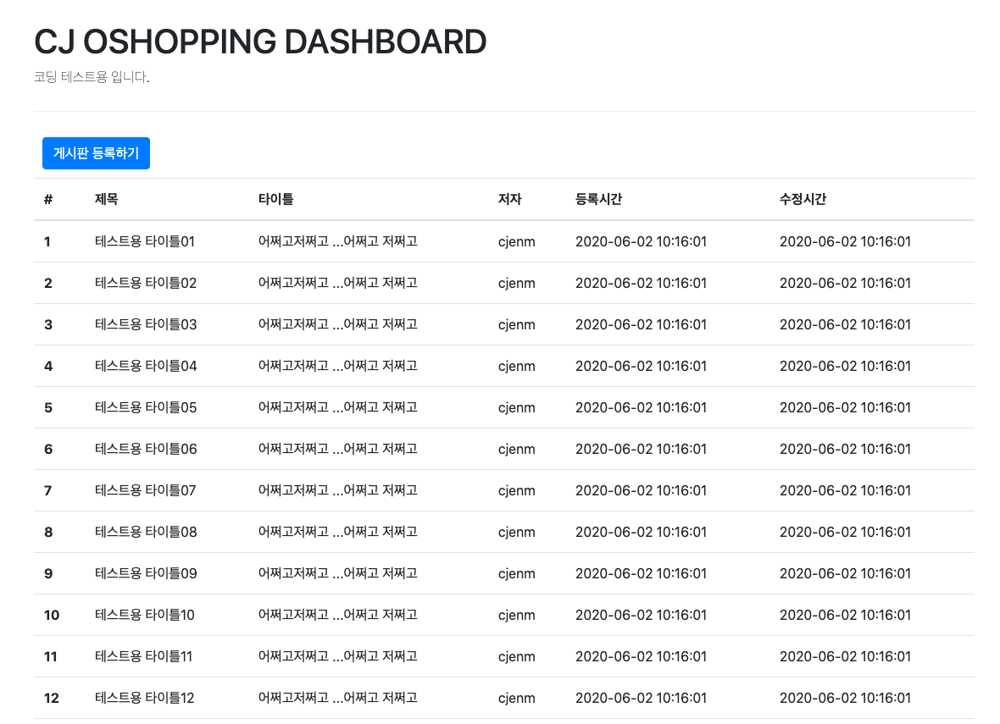
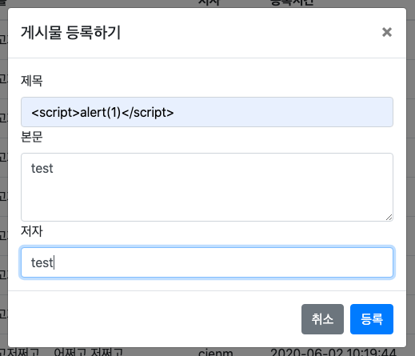
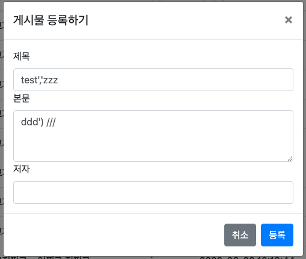

# cj 오쇼핑 코딩테스트

## 개발 환경 스팩

* Build Tool : maven
* Framework : Springboot + Spring web starter 
* JVM : java8
* Database : h2
* Persistence framework : mybatis

## 소스 구현 사항

* 게시글 목록
* 게시글 등록

## 소스 실행 방법
<pre><code>mvn spring-boot:run</code></pre>

## 게시판 아래의 요구사항에 맞게 수정 하여 주세요

* 게시글 목록 하위에 pagenation 구현
* cross site scripting 공격 방어 구현
* sql injection 공격 방어 구현
* 게시글 등록시 서버단 vaildation 구현

### 참고 
#### cross site scripting 공격 예제 

#### sql injection 공격 예제 

